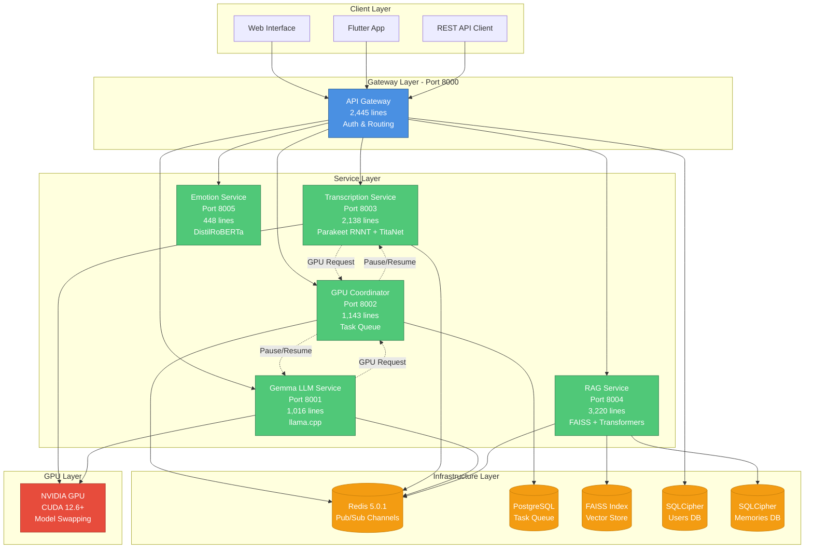
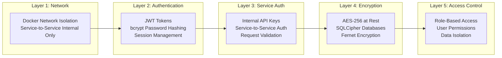
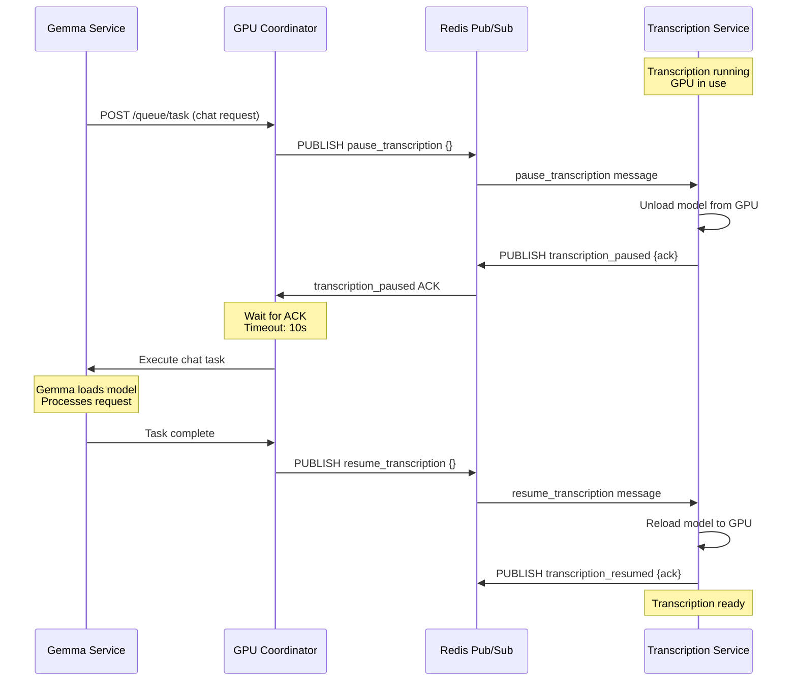

# Nemo Server v2 - Distributed Microservices Architecture

[](https://opensource.org/licenses/MIT)
[](https://www.python.org/downloads/)
[](https://www.docker.com/)
[](https://developer.nvidia.com/cuda-downloads)
[](https://github.com/psf/black)

**Enterprise-Grade AI Conversational Platform with Real-Time Transcription, Semantic Memory & GPU Coordination**

A production-ready, horizontally-scalable microservices ecosystem providing real-time speech-to-text transcription, speaker diarization, emotion analysis, RAG-powered semantic search, and LLM conversational AI. Built on FastAPI with Redis Pub/Sub coordination, PostgreSQL task queuing, and 5-layer security architecture.

**15,114 Lines of Production Python** | **6 Microservices** | **3 GPU-Accelerated Models** | **Sub-100ms GPU Coordination**

---

## 🎯 Core Capabilities

**Real-Time Processing Pipeline:**
1. **Transcribe** → Parakeet RNNT streaming ASR with speaker diarization (TitaNet verification)
2. **Analyze** → Multi-label emotion classification (DistilRoBERTa) with confidence scoring
3. **Remember** → FAISS vector search with sentence transformers (all-MiniLM-L6-v2)
4. **Respond** → Local LLM inference (Gemma 3 4B) with full conversational context injection

**Production Features:**
- **GPU Coordination Protocol** - Redis Pub/Sub with pause/resume orchestration (<100ms ACK)
- **Security Architecture** - 5-layer defense-in-depth: Network isolation, JWT auth, service auth, AES-256 encryption, RBAC
- **Horizontal Scalability** - Stateless services with distributed task queue (PostgreSQL)
- **Speaker Enrollment** - Audio fingerprinting with TitaNet embeddings for multi-user diarization
- **Web UI** - React-based frontend with real-time updates and memory visualization

---

## 🏗️ Architecture

### System Overview



### Service Breakdown

| Service | Port | Lines | Responsibilities | Tech Stack |
|---------|------|-------|-----------------|------------|
| **API Gateway** | 8000 | 2,445 | Request routing, JWT auth, session management, static file serving | FastAPI, bcrypt, python-jose |
| **Transcription** | 8003 | 2,138 | Real-time ASR (Parakeet RNNT), speaker diarization (TitaNet), audio preprocessing | NeMo, PyTorch, librosa |
| **Emotion Analysis** | 8005 | 448 | Multi-label emotion classification, confidence scoring | transformers, DistilRoBERTa |
| **RAG Service** | 8004 | 3,220 | Semantic search (FAISS), memory CRUD, vector embeddings, context injection | sentence-transformers, FAISS, SQLCipher |
| **Gemma LLM** | 8001 | 1,016 | Local LLM inference, prompt templating, streaming responses | llama-cpp-python, Gemma 3 4B |
| **GPU Coordinator** | 8002 | 1,143 | Task queue management, GPU arbitration, pause/resume coordination | Redis Pub/Sub, PostgreSQL, asyncio |
| **Shared Library** | N/A | 4,704 | Auth, crypto, models, security utilities, storage abstractions | cryptography, Fernet, AES-256 |

**Total:** 15,114 lines of production Python code

---

## 🔐 Security Architecture

### 5-Layer Defense-in-Depth



**Implementation Details:**

| Layer | Component | Implementation | Code Reference |
|-------|-----------|----------------|----------------|
| **Network** | Docker Compose | Internal network, no direct service exposure | `docker/docker-compose.yml` |
| **Authentication** | JWT + bcrypt | Token-based auth, password hashing (cost=12) | `shared/auth/auth_manager.py` |
| **Service Auth** | API Keys | Header validation for inter-service calls | `shared/security/service_auth.py` |
| **Encryption** | SQLCipher + Fernet | Database encryption, config encryption | `shared/crypto/`, `shared/storage/` |
| **Access Control** | RBAC | User-scoped data access, permission checks | `services/api-gateway/src/middleware/` |

---

## ⚡ GPU Coordination Protocol

### Redis Pub/Sub Orchestration

The GPU Coordinator manages shared GPU access between Transcription and Gemma services using Redis Pub/Sub with pause/resume commands.



**Performance Metrics:**
- **Pause ACK Latency:** <100ms (unload model from GPU)
- **Resume ACK Latency:** 500-800ms (reload model to GPU)
- **Lock Acquisition:** Redis distributed lock with 300s TTL
- **Queue Processing:** PostgreSQL-backed persistent task queue

**Code References:**
- Pause/Resume Logic: `services/queue-service/src/main.py`
- Redis Channels: `services/transcription-service/src/gpu_manager.py`
- Task Queue: `services/queue-service/src/database.py`

---

## 📊 Technology Stack

| Category | Technologies | Version | Purpose |
|----------|-------------|---------|---------|
| **Core Framework** | FastAPI | 0.110.3 | HTTP API, async request handling |
| **Web Server** | Uvicorn | 0.30.6 | ASGI server with workers |
| **Deep Learning** | PyTorch | 2.3-2.4 | Model inference backend |
| | NeMo Toolkit | 2.2.0 | ASR and speaker verification |
| | transformers | 4.44.0 | Emotion classification |
| | llama-cpp-python | 0.3.16 | Quantized LLM inference |
| **Vector Search** | FAISS | 1.8.0 | Semantic similarity search |
| | sentence-transformers | 3.3.1 | Text embeddings |
| **Infrastructure** | Redis | 5.0.1 | Pub/Sub, caching, distributed locks |
| | PostgreSQL | 13+ | Task queue, persistent storage |
| | SQLCipher | 1.0.4 | Encrypted SQLite databases |
| **Security** | cryptography | 42.0.5 | Encryption primitives |
| | bcrypt | 4.1.2 | Password hashing |
| | python-jose | 3.3.0 | JWT token generation/validation |
| **Audio Processing** | librosa | 0.10.1 | Audio feature extraction |
| | soundfile | 0.12.1 | Audio I/O |
| **Container** | Docker | 24.0+ | Service containerization |
| | Docker Compose | 2.20+ | Multi-container orchestration |
| **GPU** | CUDA | 12.6+ | GPU acceleration |
| | cuDNN | 8.9+ | Deep learning primitives |

---

## 🚀 Quick Start

### Prerequisites

- **NVIDIA GPU** with CUDA 12.6+ (12GB+ VRAM recommended)
- **Docker** 24.0+ and **Docker Compose** 2.20+
- **Git** for cloning repository

### Installation

```bash
# Clone repository
git clone https://github.com/pruittcolon/NeMo_Server.git
cd NeMo_Server

# Generate secrets (JWT, DB keys, Redis password)
cd docker/secrets
./generate_secrets.sh
cd ../..

# Add HuggingFace token for model downloads (optional but recommended)
echo "hf_YourTokenHere" > docker/secrets/huggingface_token

# Launch all services
docker compose -f docker/docker-compose.yml up -d

# Verify services are running
docker ps
curl http://localhost:8000/health
```

### Service URLs

| Service | URL | Status Endpoint |
|---------|-----|----------------|
| API Gateway & Web UI | http://localhost:8000 | `/health` |
| Gemma LLM | http://localhost:8001 | `/health` |
| GPU Coordinator | http://localhost:8002 | `/health` |
| Transcription | http://localhost:8003 | `/health` |
| RAG Service | http://localhost:8004 | `/health` |
| Emotion Analysis | http://localhost:8005 | `/health` |

---

## 📖 API Reference

### Authentication

**Register User:**
```bash
curl -X POST http://localhost:8000/auth/register \
  -H "Content-Type: application/json" \
  -d '{"username": "user1", "password": "SecurePass123!"}'
```

**Login:**
```bash
curl -X POST http://localhost:8000/auth/login \
  -H "Content-Type: application/json" \
  -d '{"username": "user1", "password": "SecurePass123!"}'
# Returns: {"access_token": "eyJ0eXAi...", "token_type": "bearer"}
```

### Transcription

**Upload Audio for Transcription:**
```bash
curl -X POST http://localhost:8000/transcription/upload \
  -H "Authorization: Bearer YOUR_JWT_TOKEN" \
  -F "file=@audio.wav" \
  -F "context=Meeting notes"
# Returns: transcript_id, text, speakers, timestamps
```

**Get Recent Transcripts:**
```bash
curl -X GET "http://localhost:8000/transcription/recent?limit=10" \
  -H "Authorization: Bearer YOUR_JWT_TOKEN"
```

### Emotion Analysis

**Analyze Emotion from Audio:**
```bash
curl -X POST http://localhost:8000/emotion/analyze \
  -H "Authorization: Bearer YOUR_JWT_TOKEN" \
  -F "file=@audio.wav"
# Returns: {emotions: [{label: "joy", score: 0.87}, ...], audio_metrics: {...}}
```

### Semantic Search (RAG)

**Add Memory:**
```bash
curl -X POST http://localhost:8000/rag/memory \
  -H "Authorization: Bearer YOUR_JWT_TOKEN" \
  -H "Content-Type: application/json" \
  -d '{
    "content": "Discussed Q4 product roadmap with engineering team",
    "title": "Q4 Planning Meeting",
    "tags": ["planning", "roadmap"],
    "memory_type": "meeting"
  }'
```

**Search Memories:**
```bash
curl -X POST http://localhost:8000/rag/search \
  -H "Authorization: Bearer YOUR_JWT_TOKEN" \
  -H "Content-Type: application/json" \
  -d '{
    "query": "What did we discuss about product roadmap?",
    "top_k": 5
  }'
# Returns: [{content, score, metadata}, ...]
```

### Conversational AI (Gemma)

**Chat with Context:**
```bash
curl -X POST http://localhost:8000/gemma/chat \
  -H "Authorization: Bearer YOUR_JWT_TOKEN" \
  -H "Content-Type: application/json" \
  -d '{
    "message": "Summarize my recent meetings about the product roadmap",
    "include_context": true,
    "max_tokens": 500
  }'
# LLM retrieves relevant memories via RAG, generates response
```

### Speaker Management

**Enroll Speaker:**
```bash
curl -X POST http://localhost:8000/transcription/enroll-speaker \
  -H "Authorization: Bearer YOUR_JWT_TOKEN" \
  -F "audio_file=@speaker_sample.wav" \
  -F "speaker_id=john_doe"
# Creates TitaNet embedding for speaker recognition
```

---

## 🛠️ Development

### Project Structure

```
NeMo_Server/
├── services/
│   ├── api-gateway/          # Port 8000 - Auth, routing, frontend
│   ├── transcription-service/ # Port 8003 - ASR, diarization
│   ├── emotion-service/       # Port 8005 - Emotion classification
│   ├── gemma-service/         # Port 8001 - LLM inference
│   ├── rag-service/           # Port 8004 - Semantic search
│   └── queue-service/         # Port 8002 - GPU coordination
├── shared/                    # Shared utilities (4,704 lines)
│   ├── auth/                  # JWT, bcrypt, session management
│   ├── crypto/                # AES-256, Fernet encryption
│   ├── models/                # Pydantic data models
│   ├── security/              # Service auth, validation
│   └── storage/               # SQLCipher, database abstractions
├── docker/                    # Docker configurations
│   ├── docker-compose.yml     # Service orchestration
│   ├── Dockerfile.*           # Per-service Dockerfiles
│   └── secrets/               # Encrypted credentials
├── frontend/                  # React web UI
├── models/                    # Downloaded model weights
├── tests/                     # Unit, integration, security tests
└── scripts/                   # Deployment, healthcheck scripts
```

### Running Services Individually

**API Gateway:**
```bash
cd services/api-gateway
pip install -r requirements.txt
uvicorn src.main:app --host 0.0.0.0 --port 8000
```

**Transcription Service:**
```bash
cd services/transcription-service
pip install -r requirements.txt
python src/main.py
```

### Running Tests

```bash
# Install test dependencies
pip install -r tests/requirements.txt

# Run all tests
pytest tests/ -v

# Run specific test suites
pytest tests/unit/ -v                 # Unit tests
pytest tests/integration/ -v          # Integration tests (requires services)
pytest tests/security/ -v             # Security validation
pytest tests/performance/ -v          # Load testing

# Run with coverage
pytest tests/ --cov=services --cov=shared --cov-report=html
```

### Environment Variables

Create `.env` file in project root:

```bash
# Redis
REDIS_HOST=localhost
REDIS_PORT=6379
REDIS_PASSWORD=<from docker/secrets/redis_password>

# PostgreSQL (GPU Queue)
POSTGRES_HOST=localhost
POSTGRES_PORT=5432
POSTGRES_USER=<from docker/secrets/postgres_user>
POSTGRES_PASSWORD=<from docker/secrets/postgres_password>
POSTGRES_DB=nemo_queue

# Security
JWT_SECRET=<from docker/secrets/jwt_secret>
SESSION_SECRET=<from docker/secrets/session_key>
USERS_DB_KEY=<from docker/secrets/users_db_key>
RAG_DB_KEY=<from docker/secrets/rag_db_key>

# Model Configuration
TRANSCRIPTION_MODEL=nvidia/parakeet-rnnt-0.6b
SPEAKER_MODEL=nvidia/speakerverification_en_titanet_large
EMOTION_MODEL=j-hartmann/emotion-english-distilroberta-base
EMBEDDING_MODEL=sentence-transformers/all-MiniLM-L6-v2
LLM_MODEL=models/gemma-3-4b-it-UD-Q4_K_XL.gguf

# GPU
CUDA_VISIBLE_DEVICES=0
```

---

## 🐛 Troubleshooting

### Services Won't Start

**Check Docker logs:**
```bash
docker compose -f docker/docker-compose.yml logs -f <service_name>
```

**Common issues:**
- **GPU not detected:** Verify `nvidia-docker` is installed: `docker run --rm --gpus all nvidia/cuda:12.6.0-base-ubuntu22.04 nvidia-smi`
- **Out of memory:** Reduce batch sizes in service configs or use smaller models
- **Port conflicts:** Check if ports 8000-8005 are available: `lsof -i :8000`

### Transcription Failing

**Verify GPU access:**
```bash
docker exec -it transcription-service nvidia-smi
```

**Check model download:**
```bash
ls -lh models/models--nvidia--parakeet-rnnt-0.6b/
```

### RAG Search Returns Empty

**Rebuild FAISS index:**
```bash
curl -X POST http://localhost:8004/rebuild-index \
  -H "Authorization: Bearer YOUR_JWT_TOKEN"
```

**Check database:**
```bash
docker exec -it rag-service ls -lh /app/data/
```

### GPU Coordinator Not Working

**Check Redis connectivity:**
```bash
docker exec -it queue-service redis-cli -h redis -a $(cat docker/secrets/redis_password) PING
```

**Monitor Pub/Sub channels:**
```bash
docker exec -it redis redis-cli -a $(cat docker/secrets/redis_password) \
  PSUBSCRIBE "pause_*" "resume_*" "*_paused" "*_resumed"
```

---

## 📈 Performance Tuning

### Transcription Service

- **Batch Size:** Adjust `batch_size` in `services/transcription-service/src/config.py` (default: 16)
- **Model Precision:** Use FP16 for 2x speedup: `precision="fp16"` (requires Tensor Cores)
- **Chunk Length:** Reduce `chunk_duration_ms` for lower latency (default: 1000ms)

### Gemma LLM

- **Context Length:** Limit `max_context_tokens` to reduce memory (default: 2048)
- **GPU Layers:** Increase `n_gpu_layers` in `llama.cpp` config for faster inference
- **Quantization:** Use Q4_K_M for better speed/quality tradeoff (current: Q4_K_XL)

### RAG Service

- **FAISS Index Type:** Use `IndexIVFFlat` for large datasets (>100k vectors)
- **Embedding Batch:** Increase `embedding_batch_size` for bulk indexing
- **Cache Results:** Enable Redis caching for frequent queries

---

## 🔒 Security Best Practices

1. **Rotate Secrets Regularly:**
   ```bash
   cd docker/secrets
   ./generate_secrets.sh
   docker compose -f ../docker-compose.yml restart
   ```

2. **Enable HTTPS:**
   - Use Nginx/Traefik reverse proxy with Let's Encrypt certificates
   - Update frontend API URLs to use HTTPS

3. **Restrict Network Access:**
   - Firewall rules: Only expose API Gateway port (8000)
   - Internal services communicate via Docker network

4. **Audit Logs:**
   ```bash
   docker compose -f docker/docker-compose.yml logs --since 24h > audit.log
   grep "POST /auth" audit.log  # Review authentication attempts
   ```

5. **Database Backups:**
   ```bash
   docker exec api-gateway tar czf /backup/users_db_$(date +%F).tar.gz /app/data/
   docker cp api-gateway:/backup/users_db_*.tar.gz ./backups/
   ```

---

## 🤝 Contributing

We welcome contributions! Please see [CONTRIBUTING.md](CONTRIBUTING.md) for guidelines.

### Development Workflow

1. Fork the repository
2. Create feature branch: `git checkout -b feature/your-feature`
3. Make changes and add tests
4. Run linting: `black . && flake8`
5. Run test suite: `pytest tests/`
6. Commit with descriptive message: `git commit -m "Add feature: ..."`
7. Push and create Pull Request

### Code Standards

- **Python:** Follow PEP 8, use `black` formatter (line length: 100)
- **Type Hints:** All function signatures must include type annotations
- **Docstrings:** Google-style docstrings for classes and public functions
- **Testing:** Minimum 80% code coverage for new features

---

## 📄 License

This project is licensed under the MIT License - see [LICENSE](LICENSE) file for details.

---

## 🙏 Acknowledgments

- **NVIDIA NeMo** - ASR and speaker verification models
- **Meta AI** - Llama architecture (Gemma variant)
- **Hugging Face** - transformers library and model hub
- **FastAPI** - Modern Python web framework
- **FAISS** - Efficient similarity search library

---

## 📞 Support

- **Issues:** [GitHub Issues](https://github.com/pruittcolon/NeMo_Server/issues)
- **Documentation:** [Wiki](https://github.com/pruittcolon/NeMo_Server/wiki)
- **Discussions:** [GitHub Discussions](https://github.com/pruittcolon/NeMo_Server/discussions)

---

## 🗺️ Roadmap

### v2.1 (Q1 2026)
- [ ] WebSocket streaming for real-time transcription
- [ ] Multi-GPU support with load balancing
- [ ] Kubernetes deployment configurations
- [ ] Prometheus metrics and Grafana dashboards

### v2.2 (Q2 2026)
- [ ] Fine-tuned models for domain-specific vocabulary
- [ ] Multi-language support (Spanish, French, German)
- [ ] Mobile SDK for iOS/Android
- [ ] Voice activity detection (VAD) preprocessing

### v3.0 (Q3 2026)
- [ ] Distributed deployment across multiple nodes
- [ ] Real-time collaboration features
- [ ] Advanced speaker diarization with face recognition
- [ ] On-device inference for edge deployment

---

**Built with ❤️ for the AI community**

*NeMo Server v2 - Production-Ready Conversational AI Infrastructure*
