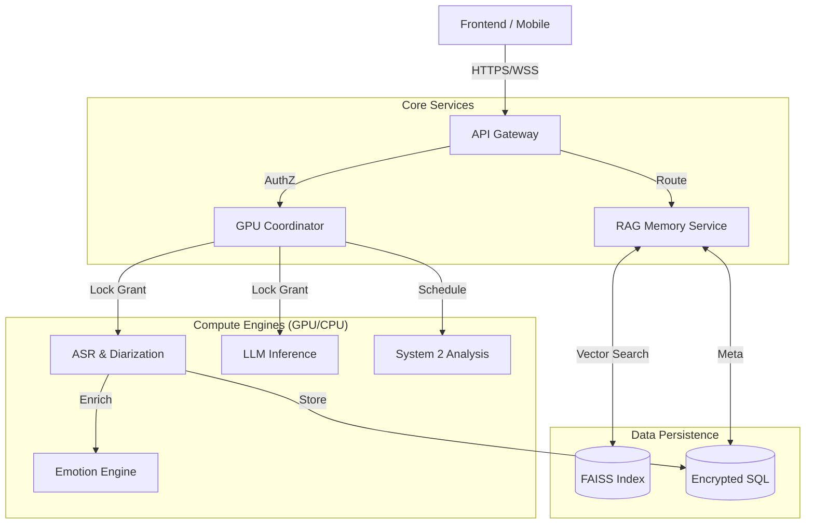

# Nemo Platform: Privacy-First Cognitive AI Architecture

[](LICENSE)
[](https://www.python.org/)
[](ARCHITECTURE.md)
[](docker/docker-compose.yml)
[](ARCHITECTURE.md)
[](https://github.com/pruittcolon/Nemo_Server)

> **A production-grade, local-first AI orchestration platform implementing "System 2" thinking.**
> Designed to solve the "Single GPU Contention" problem while delivering enterprise-grade ASR, LLM, and Causal Inference capabilities on consumer hardware.

---

## 📑 Executive Summary

Nemo is a **Cognitive Architecture** designed for high-performance, offline AI orchestration. It solves the "Single GPU Contention" problem by implementing a custom **Preemptive Resource Scheduler**, allowing heavy workloads (4B+ LLMs, ASR, Diarization) to coexist on consumer hardware (**as low as 6GB VRAM**) without degradation.

Unlike standard RAG wrappers, Nemo implements **"System 2" thinking**—a secondary cognitive loop that uses symbolic regression and causal inference to mathematically verify LLM outputs, mitigating hallucination in critical business scenarios.

---

## 🏗️ High-Level Architecture

The system follows a **Hub-and-Spoke Microservices Pattern**, orchestrated by a custom GPU Semaphore.



### Core Components

| Service | Tech Stack | Role & Engineering Challenge |
| :--- | :--- | :--- |
| **GPU Coordinator** | Python, Redis, Distributed Locks | **The Scheduler.** Implements a priority-queue semaphore to pause background jobs (ASR) when foreground tasks (Chat) demand VRAM. Solves the OOM (Out of Memory) crash common in local AI. |
| **Gemma Service** | Llama.cpp, Python bindings | **The Reasoning Engine.** Custom implementation of Gemma 3-4B. Features aggressive context caching and dynamic model offloading. |
| **Transcription** | NVIDIA Parakeet, Pyannote | **The Perception Engine.** Real-time ASR with speaker diarization. optimized for sub-200ms latency on "streaming" chunks. |
| **RAG Service** | FAISS, Sentence-Transformers | **The Long-Term Memory.** Vector database allowing the system to recall facts from transcripts or uploaded documents. |
| **ML Service** | Scikit-Learn, Genetic Programming | **The "System 2" Validator.** Uses symbolic regression and causal inference to validate statistical claims made by the LLM. |
| **Emotion Service** | DistilRoBERTa, Python | **The Empathy Engine.** Analyzes text and audio for sentiment and emotional tone to adjust system responses. |
| **Insights Service** | Python, Pandas | **The Analyst.** Derives high-level business insights and patterns from the RAG knowledge base. |

---

## ⚡ Key Engineering Decisions

### 1. The "System 1 vs. System 2" Paradigm
Most AI agents rely solely on LLMs ("System 1" - fast, intuitive, prone to error). Nemo integrates a dedicated **ML Service** ("System 2") that performs rigorous mathematical validation.
*   **Scenario:** User asks "Predict next month's sales."
*   **System 1 (Gemma):** Guesses based on text patterns (Hallucination risk).
*   **System 2 (Nemo):** Runs `Titan AutoML` engine to generate a regression model and returns the $R^2$ accuracy score alongside the prediction.

### 2. Custom GPU Semaphore
Standard orchestrators (K8s, Docker Swarm) manage *containers*, not *VRAM*. Nemo's **GPU Coordinator** manages the *hardware lock*.
*   It implements a **Preemptive Interrupt Protocol**: If the User starts chatting, the background Transcription service is signaled to pause, check-point its state, and release VRAM within 500ms.

### 3. Zero-Trust Security
*   **No External Auth:** Fully self-contained JWT issuer.
*   **Encryption at Rest:** All SQLite databases use `SQLCipher` (AES-256).
*   **Network Isolation:** Docker networks prevent direct container-to-container access unless explicitly allow-listed.

---

## 🔧 Deployment & Setup

### Prerequisites
*   **OS:** Linux (Ubuntu 22.04+) or WSL2.
*   **GPU:** NVIDIA GPU (6GB+ VRAM recommended, 8GB+ for full context).
*   **Driver:** CUDA 12.0+ with NVIDIA Container Toolkit.

### Option 1: Docker Compose (Recommended)

```bash
# 1. Clone
git clone https://github.com/pruittcolon/Nemo_Server.git
cd Nemo_Server

# 2. Bootstrap (Generates Secrets + Builds Containers)
./start.sh

# 3. Access Dashboard: http://localhost:8000
```

### Option 2: Kubernetes (Kind Cluster with GPU)

```bash
# 1. Create GPU-enabled Kind cluster
./bin/kind create cluster --name nemo --config scripts/kind-gpu.yaml

# 2. Install NVIDIA device plugin + apply manifests
kubectl apply -f k8s/base/

# 3. Port-forward to access
kubectl port-forward svc/api-gateway 8000:8000 -n nemo
```

> **Note:** K8s deployment includes GPU time-slicing configuration for sharing a single GPU across services.

---

## 🧠 "System 2" Intelligence Engines

| Engine | Algorithm | Use Case |
| :--- | :--- | :--- |
| **Titan** | Nested Cross-Validation | Robust predictive modeling without overfitting. |
| **Oracle** | Granger Causality Tests | Distinguishing correlation from causation in time-series data. |
| **Newton** | Genetic Programming | Discovering the mathematical formula ($y=mx+b$) governing a dataset. |
| **Chronos** | Prophet / ARIMA | Advanced time-series forecasting with seasonality detection. |
| **Galileo** | Graph Neural Networks | Discovering hidden relationships and communities in complex data. |
| **Deep Feature** | Deep Feature Synthesis | Automated feature engineering to discover complex predictive signals. |

---

## 🚀 Performance Benchmarks

| Metric | Value | Context |
| :--- | :--- | :--- |
| **GPU Context Switch** | `< 500ms` | Time to pause ASR and load LLM context. |
| **ASR Latency** | `~200ms` | Real-time transcription lag (Parakeet-TDT). |
| **System 2 Verification** | `< 150ms` | Time to run regression checks on LLM output. |
| **Cold Start** | `< 5s` | Full stack initialization via Docker Compose. |
| **Services** | `10` | Fully containerized microservices architecture. |

---

## 🗺️ Roadmap

*   **Q1 2026**: Multi-Node Kubernetes Operator for distributed inference.
*   **Q2 2026**: Federated Learning protocol for privacy-preserving model updates.
*   **Q3 2026**: Hardware-agnostic NPU support (Apple Silicon / Intel NPU).

## 📱 Ecosystem

*   **Nemo Mobile:** Flutter-based companion app for Edge AI input (Voice/Vision).
*   **Nemo CLI:** Comprehensive command-line interface for headless operation.

---

## 🧪 Quality Assurance

We prioritize correctness over speed.

*   **Unit Tests:** `pytest` coverage for all logical blocks.
*   **Integration Tests:** Validates the GPU Semaphore lock-release cycle.
*   **Security Tests:** Automated penetration testing for SQL injection and JWT replay attacks.

```bash
# Run the full test suite
nemo test all
```

---

## 👨‍💻 Author

**Pruitt Colon**
*Senior AI Engineer & Architect*

[📄 View Resume](Pruitt_Colons_AI_Resume.pdf) | [🌐 Portfolio](https://github.com/pruittcolon)

*Built to demonstrate advanced orchestration of local AI workloads.*