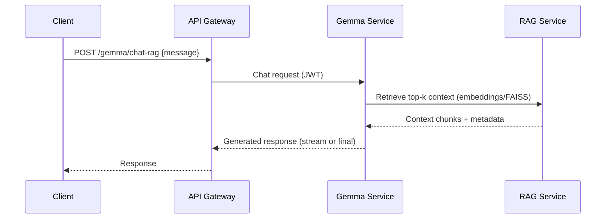
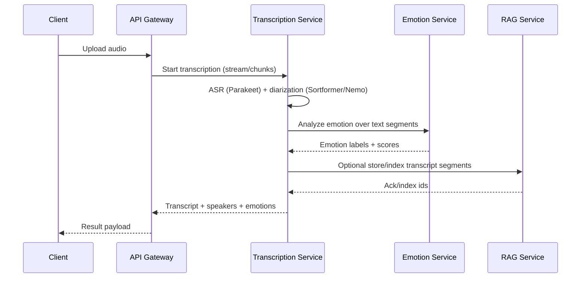
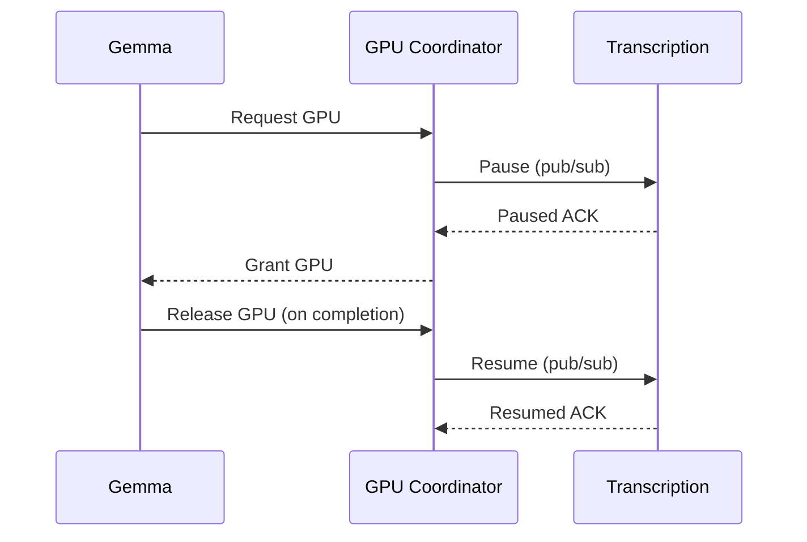

Nemo Server — Architecture Overview

Purpose
- Present a clear, senior‑level view of the platform’s architecture: goals, components, trust boundaries, critical flows, and operational design. This is the canonical reference for reviewers, architects, SREs, and security.

System Goals
- Unified conversational platform combining LLM (Gemma), RAG search, real‑time ASR with diarization, and emotion analysis.
- Single public surface with a hardened gateway; all model/runtime services remain private.
- Deterministic startup and health, predictable GPU scheduling, and repeatable deployments via Docker.
- Strong secrets hygiene and encryption for auxiliary data.

High‑Level Topology
```mermaid
graph LR
  subgraph Clients
    W[Web UI (frontend/)]
    M[Flutter Mobile (EvenDemoApp)]
    API[Programmatic Clients]
  end

  W --> G[API Gateway :8000]
  M --> G
  API --> G

  subgraph Internal Services (Private Network)
    Q[GPU Coordinator :8002]
    T[Transcription :8003]
    LLM[Gemma LLM :8001]
    RAG[RAG Service :8004]
    EMO[Emotion :8005]
    INS[Insights :8010]
  end

  G --> Q
  G --> T
  G --> LLM
  G --> RAG
  G --> EMO
  G --> INS

  subgraph Infrastructure (Private)
    REDIS[(Redis :6379)]
    PG[(Postgres :5432)]
    IDX[(FAISS Index)]
    DB[(Encrypted Aux DBs)]
  end

  Q --- REDIS
  T --- REDIS
  LLM --- REDIS
  RAG --- IDX
  RAG --- DB
  Q --- PG
```

Trust Boundaries
- Public → Gateway: TLS termination at the edge; gateway enforces authentication, authorization, CORS, and rate limits.
- Gateway → Services: Private Docker network; JWT‑only S2S; requests validated and normalized by gateway.
- Services → Infra: Private network; no host exposure in production; auxiliary stores encrypted with keys from Docker secrets.

Service Responsibilities
- API Gateway (`services/api-gateway`)
  - Public entrypoint. Authn/z, session, rate limiting, CORS, static assets. Proxies to internal services and normalizes error contracts.
- GPU Coordinator (`services/queue-service`)
  - Mediates GPU access between Transcription and Gemma to prevent contention; provides back‑pressure.
- Gemma Service (`services/gemma-service`)
  - LLM inference. Integrates with RAG for retrieval‑augmented prompts; supports warmup and stats.
- Transcription Service (`services/transcription-service`)
  - Real‑time ASR with Parakeet TDT and diarization; integrates with Emotion and RAG.
- RAG Service (`services/rag-service`)
  - Embeddings, FAISS vector search, encrypted auxiliary datasets (e.g., email analyzer DB).
- Emotion Service (`services/emotion-service`)
  - Text emotion/sentiment classification; used on transcripts and chat.
- Insights Service (`services/insights-service`)
  - Analytics/aggregation across stored artifacts and events.

Critical Flows
1) Chat with Retrieval (RAG)


2) Transcription + Diarization + Emotion + Memory


3) GPU Arbitration (Pause/Resume)


Security Architecture
- Identity & Access: JWT‑only S2S; user sessions at the gateway. Rate limiting is enabled by default.
- Secrets: Provided via Docker secrets (`docker/secrets/`), not env vars. Includes JWT keys, session key, DB encryption keys, and HF token.
- Data Protection: Auxiliary DBs (e.g., email analyzer) encrypted at rest; access via scoped APIs only. Avoid raw data persistence unless required.
- Container Hardening: Gateway runs `read_only`, with tmpfs scratch, `no-new-privileges`, and dropped Linux capabilities. Similar profiles recommended across services in production.
- Network: Only `api-gateway` exposes a host port. Infra (Redis/Postgres) binds to loopback in dev and is not exposed in prod.

Data & Storage
- Vector Store: FAISS index on disk managed by the RAG service; embedding model defaults to `sentence-transformers/all-MiniLM-L6-v2`.
- Encrypted Aux Stores: SQLite/SQLCipher‑style or app‑level encryption for email analyzer and users DB. Keys are file‑mounted secrets.
- Artifacts: Transcript segments, emotion labels, and analysis outputs are scoped per user; retention/purge jobs should enforce data windows.

Models & Inference Strategy
- Gemma (LLM): GGUF quantized model mounted from `models/` with configurable GPU layer offload and context window.
- ASR: Parakeet TDT for transcription; diarization via NeMo Sortformer (configurable max speakers). CUDA/torch envs aid debugging and memory tuning.
- Emotion: DistilRoBERTa‑based classifier for text emotion; invoked per segment or document.

Scalability & Availability
- Horizontal scale at the gateway and stateless services; GPU services scale vertically and are mediated by the coordinator for contention control.
- Back‑pressure: Coordinator ensures Gemma and Transcription do not thrash VRAM; pause/resume protocol enforces mutual exclusion on the GPU.
- Persistence: Redis (pub/sub, locks, caching) and Postgres (queue/coordination) underpin coordination; configure HA in production.

Configuration & Secrets (Selected)
- Gateway: origins, rate limits, session cookie policy.
- Gemma: `GEMMA_MODEL_PATH`, `GEMMA_GPU_LAYERS`, `GEMMA_CONTEXT_SIZE`, `GEMMA_BATCH_SIZE`, `RAG_SERVICE_URL`.
- Transcription: `TRANSCRIBE_STRATEGY`, `PARAKEET_MODEL_ID`, `PARAKEET_CHUNK_DURATION`, `ENABLE_PYANNOTE`, `SORTFORMER_MODEL`, `SORTFORMER_MAX_SPKS`.
- RAG: `EMBEDDING_MODEL`, `FAISS_INDEX_PATH`, `EMAIL_DB_PATH`, `EMAIL_DB_KEY_FILE`.
- Infra URLs: `REDIS_URL`, service URLs (internal) across services.

Deployment Patterns
- Local: Docker Compose (`docker/docker-compose.yml`). GPU services require NVIDIA Container Toolkit.
- Production (Compose): Single public gateway; TLS termination and HSTS at reverse proxy; secrets via Docker secrets; read‑only containers with tmpfs; no host port exposure for internal services.
- Path to Kubernetes: Map Docker secrets → K8s Secrets; use `nvidia.com/gpu` resources; keep ClusterIP for internal services and a single Ingress to the gateway.

Observability & SLOs
- Health: `/health` on all services; compose healthchecks for boot sequencing; promotion gates should check health before routing.
- Logging: Centralize container logs; keep startup bundles under `logs/` for triage.
- Suggested SLIs: gateway availability, error rate, p95 latency, GPU utilization, ASR latency, RAG hit rate.

Performance Tuning (Highlights)
- Gemma: tune quantization and GPU layer count for VRAM; adjust batch size and context length per workload.
- Transcription: reduce chunk duration for lower latency; cap max speakers; set CUDA allocator split size.
- RAG: choose FAISS index type (flat vs. IVF/HNSW) based on corpus size; batch embeddings; warm caches.

Risks & Mitigations
- GPU Contention: Coordinator enforces pause/resume and lock TTLs; services must ACK within timeouts.
- Secret Exposure: Secrets are file‑mounted; tests ensure `.gitignore` blocks accidental commits.
- Prompt Injection & PII: Gateway sanitizes inputs; limit context sources; redact logs; apply retention windows.
- Infra Drift: Compose and Dockerfiles define immutable builds; CI performs lint/tests/builds.

Roadmap (Abbreviated)
- WebSocket streaming for real‑time ASR and generation
- Multi‑GPU/node‑aware scheduling
- Kubernetes manifests and Helm charts
- Prometheus metrics and OpenTelemetry tracing

Key References
- `docker/docker-compose.yml` — service definitions, healthchecks, secrets, and network
- `services/*/` — per‑service implementations and READMEs
- `README.md` — platform summary and quick start

