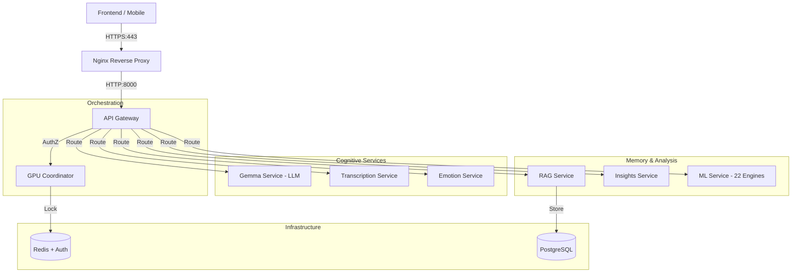
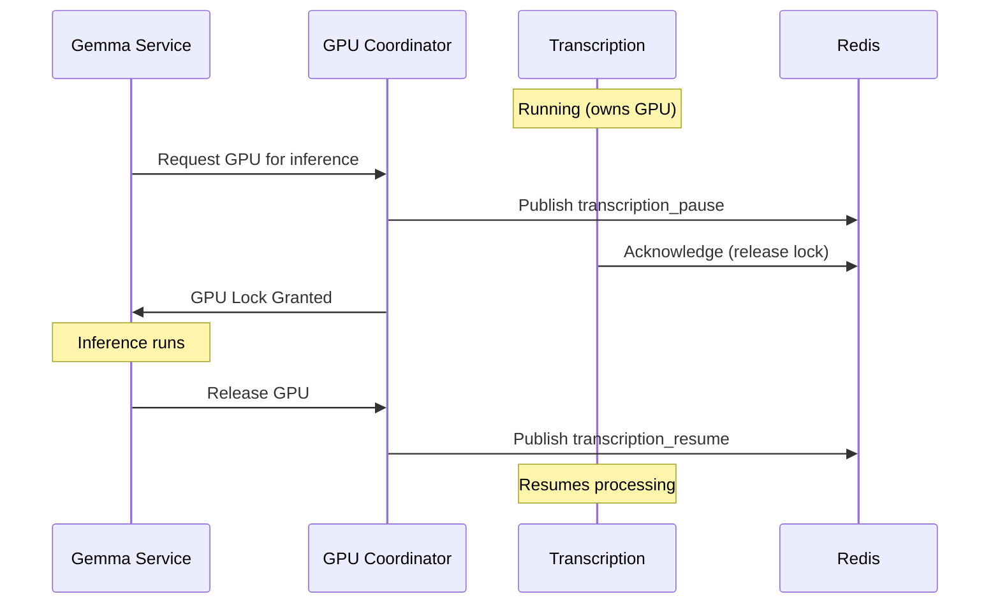

# Vox Amelior Architecture

## 1. System Overview

Vox Amelior is a local-first, privacy-focused cognitive AI platform designed to run enterprise-grade AI workloads on consumer hardware (single-GPU setups like GTX 1660 Ti with 6GB VRAM). It employs a "System 2" architecture, distinguishing between fast, intuitive responses (LLM) and slow, deliberate reasoning (AutoML/Symbolic Regression).

### Key Design Principles
- **Zero Data Exfiltration**: All processing happens locally.
- **Single GPU Orchestration**: A custom semaphore system prevents VRAM contention between heavy services (LLM, ASR).
- **System 2 Verification**: LLM outputs are cross-verified by deterministic ML engines.
- **Defense in Depth**: Multiple security layers including TLS, JWT auth, Redis auth, and network isolation.

## 2. Microservices Architecture

The system follows a Hub-and-Spoke pattern with **Nginx** as the TLS-terminating reverse proxy, the **API Gateway** as the central entry point, and the **GPU Coordinator** managing hardware resources.



### Service Catalog (13 Containerized Services)

| Service | Internal Port | External Binding | Description | Tech Stack |
| :--- | :---: | :---: | :--- | :--- |
| **Nginx** | 80, 443 | `0.0.0.0:80,443` | TLS reverse proxy, HSTS, security headers | Nginx 1.27 |
| **API Gateway** | 8000 | `127.0.0.1:8000` | Auth (JWT), Rate Limiting, Routing | Python, FastAPI |
| **GPU Coordinator** | 8002 | Internal only | GPU semaphore, pause/resume protocol | Python, Redis |
| **Gemma Service** | 8001 | Internal only | Gemma 3-4B LLM (4-bit quantized) | Llama.cpp, Python |
| **Transcription** | 8003 | Internal only | ASR + Speaker Diarization | PyTorch, NeMo |
| **RAG Service** | 8004 | Internal only | Vector DB + Semantic Search | FAISS, Sentence-Transformers |
| **Emotion Service** | 8005 | Internal only | Sentiment Analysis | DistilRoBERTa |
| **ML Service** | 8006 | Internal only | 22 AutoML/Causal Engines | Scikit-Learn, XGBoost |
| **Insights Service** | 8010 | Internal only | Business Analytics | Python, Pandas |
| **Fiserv Service** | 8015 | Internal only | Banking Automation & DNA Integration | Python, FastAPI |
| **n8n Service** | 8011 | `127.0.0.1:8011` | Workflow Automation (Webhooks) | Node.js |
| **Redis** | 6379 | `0.0.0.0:6379` | Cache, Pub/Sub, GPU Lock | Redis 7 + Auth |
| **PostgreSQL** | 5432 | `0.0.0.0:5432` | Relational DB | PostgreSQL 15 |

## 3. Enterprise Features (Phase 5)

### 3.1 API Versioning
-   **Strategy**: URL Path Versioning (`/api/v1/...`).
-   **Implementation**: `APIRouter` in Gateway. Legacy routes aliased for compatibility.
-   **Goal**: Safe evolution of API contracts without breaking clients.

### 3.2 Observability
-   **Structured Logging**: JSON-formatted logs (`shared/logging/structured.py`) for ingest into ELK/Datadog.
-   **Prometheus Metrics**: `/metrics` endpoint on all services (`shared/telemetry/metrics.py`).
-   **OpenTelemetry**: Distributed tracing with W3C context propagation (`shared/telemetry/__init__.py`).
-   **Circuit Breaker**: Inter-service HTTP clients with retry and circuit breaker patterns (`shared/clients/base.py`).
-   **SLO Tracking**: Availability (99.9%) and Latency targets defined in `docs/SLO.md`.
-   **HPA**: Kubernetes HorizontalPodAutoscalers for Gateway, ML Service, and Transcription.

## 4. Security Architecture

### 4.1 TLS/HTTPS
- **TLS 1.2+** with modern cipher suites (ECDHE, CHACHA20, AES-GCM)
- **HSTS** header with 1-year max-age, includeSubDomains, preload
- **HTTP→HTTPS redirect** on port 80

### 4.2 Secrets Management
- **Docker secrets** stored in `docker/secrets/` with **600 permissions**
- Mounted at `/run/secrets/` (never env vars)
- Non-destructive generation via `scripts/setup_secrets.sh`

### 4.3 Authentication (User & Service)
- **User Auth**: JWT-based with rotation. Secure cookies, CSRF tokens with double-submit pattern.
- **Service-to-Service (S2S)**: Mutual JWT authentication (`X-Service-Token`) required for internal communication (Gateway ↔ Services). Prevents lateral movement.
- **Replay Protection**: Redis-backed JTI tracking prevents token reuse (see `shared/security/service_auth.py`).
- **Fail-Closed Startup**: `shared/security/startup_checks.py` blocks startup without valid secrets when `SECURE_MODE=true`.

### 4.4 Network Security
- **Redis Auth**: Password required.
- **Internal Only**: All services bind `0.0.0.0` inside container but mapped to `127.0.0.1` on host.
- **CORS**: Strict origin policies.

### 4.5 Container Hardening
- **Read-Only Root Filesystem**: `read_only: true` in docker-compose.
- **Capability Drops**: `cap_drop: [ALL]`.
- **Non-Root User**: Services run as `nemo` (uid 1000).

### 4.6 Data Protection
- **Integrity**: JSON+HMAC verification for ML models (no pickle).
- **Encryption**: Database connections encrypted where possible.

## 4. GPU Semaphore Protocol



**Timeouts**: Pause acknowledgment within 10 seconds, else force preemption.

## 5. Data Flow

### Transcription Pipeline
```
Audio → Parakeet ASR → Speaker Diarization → Emotion Analysis → RAG Storage
```

### Chat Pipeline
```
User Query → Gateway → Gemma (LLM) → RAG Context → Response
                    ↓
              ML Service (System 2 Verification)
```

## 6. Deployment

### Docker Compose (Recommended)
```bash
# Generate secrets and certificates
./scripts/setup_secrets.sh
./scripts/generate_certs.sh

# Start all services
./nemo

# Access: https://localhost (accept self-signed cert warning)
```

### Kubernetes
Full manifests in `k8s/base/`:
- **NetworkPolicies**: Default-deny with service-specific allow rules
- **GPU Support**: NVIDIA device plugin with time-slicing
- **Secrets**: Kubernetes secrets mounted as files

```bash
kubectl apply -f k8s/base/
kubectl port-forward svc/nginx 443:443 -n nemo
```

## 7. Verification

```bash
# Security posture check
python3 scripts/verify_security.py

# Full test suite (29 tests)
python3 scripts/nemo_test_suite.py --all

# Stress test
python3 scripts/nemo_test_suite.py --stress
```

## 8. Mobile App Integration

The Flutter mobile app (`mobile-app/`) connects to the backend via HTTPS and provides additional voice command capabilities.

### Mode Handlers

| Mode | Trigger | Description |
|------|---------|-------------|
| Chat | "Chat" | Context-aware conversations via Gemma |
| Interview | "Interview" | Interview preparation mode |
| Alexa | "Alexa" | Smart home control via VoiceMonkey |
| Roku | "Roku" | TV remote commands |
| **Google AI** | Command patterns | Timer, alarm, call, search, navigation |

### Google AI Mode (v1.2.0)

Executes voice commands locally via **Android Intents** (no API limits):

```
User speaks → Deepgram STT → CommandParser → Android Intent → Native App
```

Supported: timers, alarms, calls, messages, web search, navigation.

See `mobile-app/README.md` for full documentation.
