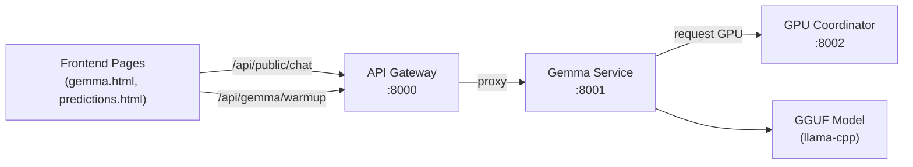

# Gemma AI Implementation Guide

Complete reference for implementing Gemma AI chat and summary functionality across the Nemo Server platform.

---

## Architecture Overview



---

## Key Files

| Component | File | Purpose |
|-----------|------|---------|
| **Gemma Service** | `services/gemma-service/src/main.py` | LLM inference engine with GPU management |
| **API Gateway** | `services/api-gateway/src/main.py` | Proxies requests to Gemma, handles auth |
| **Frontend Chat** | `frontend/gemma.html` | Interactive chat interface |
| **ML Integration** | `frontend/predictions.html` | Example of Gemma summaries for ML results |

---

## API Endpoints

### 1. Public Chat Endpoint (No Auth Required)
**Endpoint:** `POST /api/public/chat`  
**Use Case:** General AI chat without authentication

```javascript
// Frontend Usage
const response = await fetch('/api/public/chat', {
  method: 'POST',
  headers: { 'Content-Type': 'application/json' },
  credentials: 'include',
  body: JSON.stringify({
    messages: [
      { role: 'user', content: 'Your prompt here' }
    ],
    max_tokens: 500,
    temperature: 0.7,
    top_p: 0.9
  })
});
const data = await response.json();
const answer = data.message || data.response || data.text;
```

**Gateway Routing (`main.py` line 1242-1247):**
```python
@app.post("/api/public/chat")
async def public_chat(request: Dict[str, Any], http_request: Request):
    """Public chat endpoint for unauthenticated chatbot access (IP rate-limited)"""
    result = await proxy_request(f"{GEMMA_URL}/chat", "POST", json=request)
    return result
```

---

### 2. Authenticated Chat
**Endpoint:** `POST /api/gemma/chat`  
**Use Case:** Chat with session authentication

```javascript
const response = await fetch('/api/gemma/chat', {
  method: 'POST',
  headers: { 'Content-Type': 'application/json' },
  credentials: 'include',
  body: JSON.stringify({
    messages: [{ role: 'user', content: prompt }],
    max_tokens: 500
  })
});
```

---

### 3. GPU Warmup
**Endpoint:** `POST /api/gemma/warmup`  
**Use Case:** Pre-load model on GPU for fast inference

```javascript
async function warmupGemma() {
  const response = await fetch('/api/gemma/warmup', {
    method: 'POST',
    headers: { 'Content-Type': 'application/json' },
    credentials: 'include',
    body: JSON.stringify({})
  });
  return response.ok;
}
```

---

### 4. GPU Stats
**Endpoint:** `GET /api/gemma/stats`  
**Use Case:** Monitor GPU/VRAM usage

```javascript
const stats = await fetch('/api/gemma/stats', { credentials: 'include' }).then(r => r.json());
console.log(stats.vram_used_mb, stats.vram_total_mb, stats.model_on_gpu);
```

---

## Request/Response Format

### Request Schema
```typescript
interface ChatRequest {
  messages: Array<{
    role: 'user' | 'assistant' | 'system';
    content: string;
  }>;
  max_tokens?: number;      // Default: 512
  temperature?: number;     // Default: 0.7
  top_p?: number;           // Default: 0.9
  context?: object[];       // Optional RAG context
  stop?: string[];          // Stop sequences
}
```

### Response Schema
```typescript
interface ChatResponse {
  message?: string;    // Primary response field
  response?: string;   // Alternative response field
  text?: string;       // Fallback response field
  tokens_generated?: number;
  mode?: 'gpu' | 'cpu';
  usage?: {
    prompt_tokens: number;
    completion_tokens: number;
  };
}
```

### Response Extraction Pattern
```javascript
// Always check multiple fields (implementation varies)
const answer = data.message || data.response || data.text || 'Unable to generate response';
```

---

## Frontend Implementation Patterns

### Pattern 1: Simple Chat (gemma.html)

**Full chat implementation from `gemma.html` lines 1660-1744:**

```javascript
// State management
let chatHistory = [];
const MAX_HISTORY = 20;

async function sendChatMessage() {
  const input = document.getElementById('chat-input');
  const message = input.value.trim();
  if (!message) return;
  
  input.value = '';
  
  // Add user message to display
  addChatMessage(message, 'user');
  
  // Add to history for context
  chatHistory.push({ role: 'user', content: message });
  
  // Trim history to prevent OOM
  while (chatHistory.length > MAX_HISTORY) {
    chatHistory.shift();
  }
  
  // Show thinking indicator
  const thinkingId = addThinkingIndicator();
  
  try {
    const response = await fetch('/api/public/chat', {
      method: 'POST',
      credentials: 'include',
      headers: { 'Content-Type': 'application/json' },
      body: JSON.stringify({
        messages: chatHistory,
        max_tokens: 500,
        temperature: 0.7,
        top_p: 0.9
      })
    });
    
    const data = await response.json();
    const aiResponse = data.message || data.text || 'Error generating response';
    
    // Add to history
    chatHistory.push({ role: 'assistant', content: aiResponse });
    
    // Trim again
    while (chatHistory.length > MAX_HISTORY) {
      chatHistory.shift();
    }
    
    removeThinkingIndicator(thinkingId);
    addChatMessage(aiResponse, 'ai');
    
  } catch (error) {
    console.error('Chat error:', error);
    removeThinkingIndicator(thinkingId);
    addChatMessage('Connection error. Please try again.', 'ai');
  }
}
```

---

### Pattern 2: Analysis Summary (predictions.html)

**Gemma explains ML results from `predictions.html` lines 5391-5479:**

```javascript
async function requestGemmaExplanation(analysisData) {
  // Build context-specific prompt
  const prompt = `You are explaining analysis results to a business user.

ANALYSIS RESULTS:
- Accuracy: ${analysisData.accuracy}%
- Trend: ${analysisData.trend}
- Key metrics: ${JSON.stringify(analysisData.metrics)}

Write a 2-3 sentence explanation that:
1. Explains what the accuracy means in plain terms
2. Describes the trend and what to expect
3. Gives one actionable insight

Use simple language a business person can understand.`;

  try {
    const response = await fetch('/api/public/chat', {
      method: 'POST',
      headers: { 'Content-Type': 'application/json' },
      credentials: 'include',
      body: JSON.stringify({
        messages: [{ role: 'user', content: prompt }],
        max_tokens: 300
      })
    });
    
    const data = await response.json();
    const explanation = data.message || data.response || 'Unable to generate explanation.';
    
    // Display explanation
    document.getElementById('explanation-text').innerHTML = renderMarkdown(explanation);
    
  } catch (err) {
    console.warn('Gemma explanation failed:', err);
    document.getElementById('explanation-text').textContent = 
      'Unable to generate AI explanation at this time.';
  }
}
```

---

### Pattern 3: Follow-up Questions (predictions.html)

**Chat with analysis context from `predictions.html` lines 2800-2900:**

```javascript
async function sendFollowupQuestion(chatId, engineName, encodedSummary, encodedData) {
  const input = document.getElementById(`${chatId}-input`);
  const question = input.value.trim();
  if (!question) return;
  
  const messagesDiv = document.getElementById(`${chatId}-messages`);
  const originalSummary = decodeURIComponent(encodedSummary);
  const dataContext = decodeURIComponent(encodedData);
  
  // Add user message to UI
  messagesDiv.innerHTML += `
    <div class="followup-msg user">
      <span class="msg-label">You:</span>
      <span class="msg-text">${question}</span>
    </div>
  `;
  
  input.value = '';
  
  // Add loading indicator
  const loadingId = `loading-${Date.now()}`;
  messagesDiv.innerHTML += `
    <div class="followup-msg assistant loading" id="${loadingId}">
      <span class="msg-label">Gemma:</span>
      <span class="msg-text">Thinking...</span>
    </div>
  `;
  
  messagesDiv.scrollTop = messagesDiv.scrollHeight;
  
  // Build prompt with context
  const fullPrompt = `Context - Previous Analysis Summary:
${originalSummary}

Analysis Data:
${dataContext.substring(0, 2000)}

User Question: ${question}

Please answer based on the analysis context. Be specific and reference the actual data.`;
  
  try {
    const response = await fetch('/api/public/chat', {
      method: 'POST',
      headers: { 'Content-Type': 'application/json' },
      credentials: 'include',
      body: JSON.stringify({
        messages: [{ role: 'user', content: fullPrompt }],
        max_tokens: 500,
        temperature: 0.7
      })
    });
    
    const result = await response.json();
    const answer = result.message || result.response || 'Unable to generate response';
    
    // Replace loading with answer
    document.getElementById(loadingId).innerHTML = `
      <span class="msg-label">Gemma:</span>
      <span class="msg-text">${renderMarkdown(answer)}</span>
    `;
    
    messagesDiv.scrollTop = messagesDiv.scrollHeight;
    
  } catch (error) {
    document.getElementById(loadingId).innerHTML = `
      <span class="msg-label">Gemma:</span>
      <span class="msg-text" style="color: #ef4444;">Error: Could not get response.</span>
    `;
  }
}
```

---

## UI Components

### Thinking/Loading Indicator

```javascript
function addThinkingIndicator() {
  const container = document.getElementById('chat-messages');
  const id = 'thinking-' + Date.now();
  const html = `
    <div id="${id}" class="chat-message-row">
      <div class="chat-avatar-icon ai-avatar">
        <i data-lucide="bot" style="width: 18px; height: 18px; color: white;"></i>
      </div>
      <div class="chat-bubble-content ai-bubble">
        <div class="thinking-dots">
          <span></span><span></span><span></span>
        </div>
      </div>
    </div>
  `;
  container.insertAdjacentHTML('beforeend', html);
  container.scrollTop = container.scrollHeight;
  lucide.createIcons();
  return id;
}

function removeThinkingIndicator(id) {
  const el = document.getElementById(id);
  if (el) el.remove();
}
```

### CSS for Thinking Dots

```css
.thinking-dots {
  display: flex;
  gap: 4px;
  padding: 0.5rem 0;
}

.thinking-dots span {
  width: 8px;
  height: 8px;
  background: var(--primary);
  border-radius: 50%;
  animation: thinking 1.4s ease-in-out infinite;
}

.thinking-dots span:nth-child(2) { animation-delay: 0.2s; }
.thinking-dots span:nth-child(3) { animation-delay: 0.4s; }

@keyframes thinking {
  0%, 80%, 100% { opacity: 0.3; transform: scale(0.8); }
  40% { opacity: 1; transform: scale(1); }
}
```

### Chat Message Display

```javascript
function addChatMessage(text, sender) {
  const container = document.getElementById('chat-messages');
  const isUser = sender === 'user';
  
  // Render markdown for AI responses
  let formattedText = text;
  if (!isUser) {
    formattedText = renderMarkdown(text);
  }
  
  const messageHtml = `
    <div class="chat-message-row ${isUser ? 'user' : ''}">
      ${!isUser ? `
        <div class="chat-avatar-icon ai-avatar">
          <i data-lucide="bot" style="width: 18px; height: 18px; color: white;"></i>
        </div>
      ` : ''}
      <div class="chat-bubble-content ${isUser ? 'user-bubble' : 'ai-bubble'}">
        ${formattedText}
      </div>
      ${isUser ? `
        <div class="chat-avatar-icon user-avatar">
          <i data-lucide="user" style="width: 18px; height: 18px; color: white;"></i>
        </div>
      ` : ''}
    </div>
  `;
  
  container.insertAdjacentHTML('beforeend', messageHtml);
  container.scrollTop = container.scrollHeight;
  lucide.createIcons();
}
```

---

## Simple Markdown Renderer

```javascript
function renderMarkdown(text) {
  // Escape HTML first
  let html = text
    .replace(/&/g, '&amp;')
    .replace(/</g, '&lt;')
    .replace(/>/g, '&gt;');
  
  // Headers
  html = html.replace(/^### (.+)$/gm, '<h4>$1</h4>');
  html = html.replace(/^## (.+)$/gm, '<h3>$1</h3>');
  
  // Bold
  html = html.replace(/\*\*([^*]+)\*\*/g, '<strong>$1</strong>');
  html = html.replace(/__([^_]+)__/g, '<strong>$1</strong>');
  
  // Italic
  html = html.replace(/\*([^*]+)\*/g, '<em>$1</em>');
  html = html.replace(/_([^_]+)_/g, '<em>$1</em>');
  
  // Bullet points
  html = html.replace(/^\s*[\*\-]\s+(.+)$/gm, '<li>$1</li>');
  
  // Wrap consecutive <li> in <ul>
  html = html.replace(/(<li[^>]*>.*?<\/li>\s*)+/g, (match) => {
    return `<ul>${match}</ul>`;
  });
  
  // Line breaks
  html = html.replace(/\n/g, '<br>');
  
  return html;
}
```

---

## Backend: Gemma Service Deep Dive

### Model Loading (GPU Mode)

From `gemma-service/src/main.py` lines 163-201:

```python
def load_model_gpu():
    """Load model directly on GPU at startup"""
    global gemma_model, model_on_gpu
    
    gemma_model = Llama(
        model_path=GEMMA_MODEL_PATH,
        n_ctx=GEMMA_CONTEXT_SIZE,  # Context window (25k tokens)
        n_batch=512,               # Larger batch for faster prompt processing
        n_gpu_layers=-1,           # ALL layers on GPU
        n_threads=4,               # Fewer CPU threads since GPU does the work
        use_mlock=False,           # Don't lock memory
        use_mmap=True,             # Use memory mapping
        flash_attn=True,           # Flash attention for performance
        verbose=True,
    )
    model_on_gpu = True
```

### Chat Endpoint Processing

From `gemma-service/src/main.py` lines 874-1010:

```python
@app.post("/chat")
async def chat(request: ChatRequest):
    """Chat with conversation history - uses GPU coordinator"""
    task_id = f"gemma-chat-{uuid.uuid4().hex[:12]}"
    
    # 1. Request GPU slot from coordinator
    async with httpx.AsyncClient(timeout=30.0) as client:
        coord_response = await client.post(
            f"{GPU_COORDINATOR_URL}/gemma/request",
            json={
                "task_id": task_id,
                "messages": [{"role": m.role, "content": m.content} for m in request.messages],
                "max_tokens": request.max_tokens,
                "temperature": request.temperature,
            },
            headers=get_service_headers()
        )
    
    # 2. Move model to GPU if needed
    if not model_on_gpu:
        move_model_to_gpu()
    
    # 3. Build prompt from messages
    prompt = "You are a helpful AI assistant. Always respond in English.\n\n"
    for msg in request.messages:
        prompt += f"{msg.role.upper()}: {msg.content}\n"
    prompt += "ASSISTANT: "
    
    # 4. Reset model state (critical for context management)
    gemma_model.reset()
    
    # 5. Execute inference
    response = gemma_model(
        prompt=prompt,
        max_tokens=request.max_tokens,
        temperature=request.temperature,
        top_p=request.top_p,
        stop=stop_sequences,
        echo=False,
    )
    
    # 6. Return response
    return {
        "message": response["choices"][0]["text"].strip(),
        "tokens_generated": response["usage"]["completion_tokens"],
        "mode": "gpu" if model_on_gpu else "cpu"
    }
```

---

## Gateway Proxying

From `api-gateway/src/main.py` lines 1063-1203:

```python
async def proxy_request(url: str, method: str = "POST", json: dict = None):
    """Proxy request to backend service with JWT auth"""
    headers = {"X-Request-Id": str(uuid.uuid4())[:12]}
    
    # Add service JWT for inter-service auth
    if service_auth:
        token = service_auth.create_token(expires_in=60, aud="internal")
        headers["X-Service-Token"] = token
    
    async with httpx.AsyncClient(timeout=120.0) as client:
        if method == "POST":
            response = await client.post(url, headers=headers, json=json)
        else:
            response = await client.get(url, headers=headers)
        
        response.raise_for_status()
        return response.json()
```

---

## Environment Variables

| Variable | Default | Description |
|----------|---------|-------------|
| `GEMMA_URL` | `http://gemma-service:8001` | Gemma service URL |
| `GEMMA_MODEL_PATH` | `/models/gemma.gguf` | Path to GGUF model file |
| `GEMMA_CONTEXT_SIZE` | `25000` | Context window size |
| `GEMMA_GPU_LAYERS` | `-1` | GPU layers (-1 = all) |
| `GPU_COORDINATOR_URL` | `http://gpu-coordinator:8002` | GPU coordinator URL |

---

## Implementation Checklist

When adding Gemma to a new page:

- [ ] Include auth check if using authenticated endpoints
- [ ] Implement chat history tracking (array of `{role, content}`)
- [ ] Add thinking/loading indicator
- [ ] Handle multiple response field names (`message`, `response`, `text`)
- [ ] Implement markdown rendering for AI responses
- [ ] Add error handling for network failures
- [ ] Consider GPU warmup for first request (`/api/gemma/warmup`)
- [ ] Add context to prompts for domain-specific analysis
- [ ] Limit chat history length to prevent OOM (20-30 messages)
