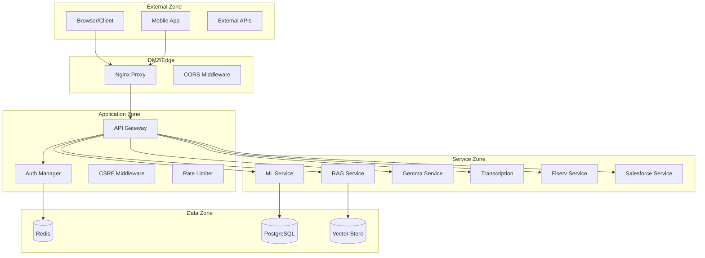

# Threat Model: Vox Amelior Platform

## Document Information

| Field | Value |
|-------|-------|
| Version | 1.0 |
| Last Updated | 2024-12-23 |
| Classification | Internal |
| Review Cycle | Quarterly |

---

## Executive Summary

This document provides a comprehensive threat model for the Vox Amelior platform using the STRIDE methodology. It identifies assets, trust boundaries, threats, and mitigations for the enterprise AI platform.

---

## 1. System Overview

### 1.1 Architecture Components

### 1.2 Data Classification

| Classification | Examples | Protection Required |
|---------------|----------|---------------------|
| **Restricted** | PII, credentials, API keys | Encryption at rest/transit, audit logging |
| **Confidential** | Financial data, transcripts | Encryption, access control |
| **Internal** | Analytics, logs | Access control |
| **Public** | API docs, status | None |

---

## 2. Trust Boundaries

### Boundary 1: Internet → Nginx (External Boundary)
- **Traffic Type**: HTTPS only
- **Controls**: TLS 1.2+, HSTS, Certificate pinning
- **Threats**: DDoS, TLS stripping, certificate spoofing

### Boundary 2: Nginx → API Gateway (Edge to Application)
- **Traffic Type**: HTTP (internal), mTLS recommended
- **Controls**: Rate limiting, security headers, CORS
- **Threats**: Request smuggling, header injection

### Boundary 3: API Gateway → Services (Application to Service)
- **Traffic Type**: HTTP with S2S JWT
- **Controls**: Service authentication, request validation
- **Threats**: Service impersonation, token theft

### Boundary 4: Services → Data Stores (Service to Data)
- **Traffic Type**: Encrypted connections
- **Controls**: Connection auth, query parameterization
- **Threats**: SQL injection, data exfiltration

---

## 3. STRIDE Threat Analysis

### 3.1 Spoofing Identity

| Threat | Target | Likelihood | Impact | Mitigation |
|--------|--------|------------|--------|------------|
| Session hijacking | User sessions | Medium | High | Secure cookies, session rotation |
| JWT token theft | Auth tokens | Medium | High | Short expiry, JTI tracking, Redis revocation |
| Service impersonation | S2S communication | Low | Critical | Mutual JWT, service registry |
| Credential stuffing | Login endpoint | High | Medium | Rate limiting, MFA, account lockout |

**Current Mitigations:**
- ✅ JWT with JTI replay protection (`shared/security/`)
- ✅ Redis-backed session management
- ✅ Rate limiting on auth endpoints (`core/middleware.py`)
- ⚠️ MFA not yet implemented

### 3.2 Tampering

| Threat | Target | Likelihood | Impact | Mitigation |
|--------|--------|------------|--------|------------|
| Request manipulation | API payloads | Medium | High | Input validation, HMAC |
| CSRF attacks | State-changing endpoints | Medium | High | Double-submit cookies |
| SQL injection | Database queries | Low | Critical | Parameterized queries, ORM |
| Log tampering | Audit logs | Low | Medium | Write-only log storage |

**Current Mitigations:**
- [x] Pydantic input validation on all endpoints
- [x] CSRF middleware with double-submit pattern
- [x] SQLAlchemy ORM for database access
- [x] Structured audit logging (`shared/audit/`)

### 3.3 Repudiation

| Threat | Target | Likelihood | Impact | Mitigation |
|--------|--------|------------|--------|------------|
| Denial of action | User actions | Medium | Medium | Comprehensive audit logging |
| Log deletion | Audit trail | Low | High | Append-only logs, remote backup |
| Timestamp manipulation | Event ordering | Low | Medium | NTP sync, server-side timestamps |

**Current Mitigations:**
- [x] Audit events for security-relevant actions
- [x] Request ID tracking across services
- [ ] Centralized log aggregation (Loki configured but verify)

### 3.4 Information Disclosure

| Threat | Target | Likelihood | Impact | Mitigation |
|--------|--------|------------|--------|------------|
| Error messages leaking | Stack traces | Medium | Medium | Generic error responses |
| API enumeration | Endpoint discovery | Low | Low | Rate limiting |
| Credential exposure | Secrets in logs | Medium | Critical | Log sanitization |
| Data breach | PII, financial data | Low | Critical | Encryption, access control |

**Current Mitigations:**
-  Structured error responses (no stack traces in production)
-  Docker secrets for credentials
-  TLS for all external connections
-  Verify PII is not logged

### 3.5 Denial of Service

| Threat | Target | Likelihood | Impact | Mitigation |
|--------|--------|------------|--------|------------|
| API flooding | All endpoints | High | High | Rate limiting per IP/user |
| GPU exhaustion | Gemma/Transcription | Medium | High | Queue management, timeouts |
| Memory exhaustion | Large uploads | Medium | Medium | Request size limits |
| Slowloris | Nginx connections | Medium | Medium | Connection timeouts |

**Current Mitigations:**
-  Redis-backed rate limiting with fallback
-  GPU Coordinator prevents concurrent lock
-  Request size limits in Nginx
-  Connection timeouts configured

### 3.6 Elevation of Privilege

| Threat | Target | Likelihood | Impact | Mitigation |
|--------|--------|------------|--------|------------|
| Role bypass | RBAC checks | Medium | Critical | Centralized authorization |
| Tenant isolation failure | Multi-tenant data | Low | Critical | Tenant ID in all queries |
| Container escape | Host system | Low | Critical | Non-root containers, seccomp |
| Insecure deserialization | Python pickle | Low | Critical | JSON only, no pickle |

**Current Mitigations:**
- ✅ Role-based access in `shared/auth/`
- ✅ Container hardening (non-root, read-only FS)
- ⚠️ Tenant isolation in progress (Month 2)

---

## 4. Security Controls Summary

### 4.1 Network Security
| Control | Status | Location |
|---------|--------|----------|
| TLS 1.2+ | ✅ Implemented | Nginx config |
| HSTS | ✅ Implemented | `middleware.py` |
| CORS restriction | ✅ Implemented | `main.py` |
| Rate limiting | ✅ Implemented | `middleware.py` |

### 4.2 Authentication & Authorization
| Control | Status | Location |
|---------|--------|----------|
| JWT authentication | ✅ Implemented | `shared/security/` |
| Session management | ✅ Implemented | Redis |
| CSRF protection | ✅ Implemented | `middleware.py` |
| Role-based access | ✅ Implemented | `shared/auth/` |

### 4.3 Data Protection
| Control | Status | Location |
|---------|--------|----------|
| Encryption at rest | ✅ Implemented | Docker secrets |
| Encryption in transit | ✅ Implemented | TLS |
| Input validation | ✅ Implemented | Pydantic models |
| Audit logging | ✅ Implemented | `shared/audit/` |

---

## 5. Risk Ratings

| Risk | Severity | Likelihood | Risk Level | Priority |
|------|----------|------------|------------|----------|
| Credential stuffing | High | High | **Critical** | P1 |
| JWT token theft | High | Medium | **High** | P1 |
| GPU resource exhaustion | High | Medium | **High** | P2 |
| Tenant data leakage | Critical | Low | **High** | P1 |
| CSRF bypass | Medium | Medium | **Medium** | P2 |
| Log tampering | Medium | Low | **Low** | P3 |

---

## 6. Recommendations

### Immediate (P1)
1. Implement account lockout after failed login attempts
2. Add MFA support for admin accounts
3. Verify tenant isolation in all database queries

### Short-term (P2)
1. Add input size limits to all file upload endpoints
2. Implement request signing for sensitive operations
3. Add anomaly detection for rate limiting

### Long-term (P3)
1. Implement zero-trust service mesh
2. Add dynamic secrets rotation
3. Implement hardware security module (HSM) for key storage

---

## 7. Review History

| Date | Reviewer | Changes |
|------|----------|---------|
| 2024-12-23 | Initial | Document created |
| 2024-12-24 | Enterprise Readiness | Added Week 1-2 security implementations |

---

## 8. Recent Security Implementations (Week 1-2)

### Security Headers (Week 1)
- ✅ **HSTS with preload**: `max-age=31536000; includeSubDomains; preload`
- ✅ **Permissions-Policy**: Restricts 20+ browser APIs (geolocation, camera, etc.)
- ✅ **Enhanced CSP**: Added `object-src 'none'`, `base-uri 'self'`, `upgrade-insecure-requests`
- ✅ **Cache-Control**: `no-store` for API responses
- ✅ **X-Permitted-Cross-Domain-Policies**: `none`

### Audit Logging (Week 1)
- ✅ **HMAC chain sealing**: Tamper-proof audit logs with cryptographic verification
- ✅ **Integrity verification**: `verify_log_integrity()` method detects modifications
- ✅ **Security field logging**: IP, user_id, request_id tracked for all requests

### Container Hardening (Week 2)
- ✅ **Redis**: `security_opt: no-new-privileges`, `cap_drop: ALL`
- ✅ **Postgres**: `security_opt: no-new-privileges`, `cap_drop: ALL`, minimal `cap_add`
- ✅ **API Gateway**: `read_only: true`, `no-new-privileges`, `cap_drop: ALL`
- ✅ **Redis TLS config**: Available at `docker/redis/redis-tls.conf`

### Authentication (Week 2)
- ✅ **JWT rotation**: Primary/previous key support via `load_service_jwt_keys()`
- ✅ **JTI replay protection**: `ReplayProtector` class with Redis backend
- ✅ **CSRF double-submit**: Enforced on all mutating endpoints

---

*This document should be reviewed quarterly and updated whenever significant architecture changes occur.*
