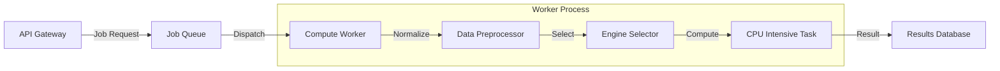

# ML Service: The "System 2" Engine

> **"The intuitive machine (LLM) makes guesses. The analytical machine (ML Service) proves them."**

The ML Service is the **Analytical Cortex** of the Nemo Platform. While the LLM provides conversational interface and broad knowledge (System 1), this service provides rigorous, mathematically sound statistical analysis (System 2) to validate hypotheses, predict trends, and discover physical laws.

---

## Core Philosophy

In Enterprise AI, hallucination is unacceptable. The ML Service acts as a **Ground Truth Generator**.
When a user asks, *"Why did sales drop?"*, an LLM might hallucinate a reason. The ML Service runs a **Granger Causality Test** to mathematically determine if a specific variable (e.g., Ad Spend) temporally preceded and correlated with the drop.

---

## The Intelligence Engines

The service exposes **36 distinct "Engines,"** each solving a specific class of analytical problem.

### 1. Titan Engine (Predictive Modeling)
**Algorithm:** `AutoML` with `5x2 Nested Cross-Validation` & `Stability Selection`.

*   **The Engineering Challenge:** Prevent overfitting on small datasets (common in local deployments).
*   **The Solution:** Titan does not just pick the "best" model. It runs hundreds of subsamples. A feature is only deemed predictive if it appears in >80% of the models (Stability Selection).
*   **Output:** Robust predictions with confidence intervals, not just point estimates.

### 2. Oracle Engine (Causal Inference)
**Algorithm:** `Granger Causality` (F-tests) and `Propensity Score Matching`.

*   **The Engineering Challenge:** Correlation $\neq$ Causation. LLMs cannot distinguish the two.
*   **The Solution:** Oracle analyzes time-series lags. It tests the null hypothesis: *"Does knowing the history of X improve the prediction of Y beyond just knowing the history of Y?"*
*   **Output:** A p-value indicating the statistical significance of a causal claim.

### 3. Newton Engine (Symbolic Regression)
**Algorithm:** `Genetic Programming` (Evolutionary Algorithms).

*   **The Engineering Challenge:** Neural networks are "Black Boxes". They give an answer but not the formula.
*   **The Solution:** Newton evolves mathematical trees (nodes are operators `+`, `-`, `*`, `sin`, `cos`). It fights for "survival of the fittest" based on accuracy and simplicity (Occam's Razor).
*   **Output:** An exact, human-readable mathematical formula (e.g., `Sales = 2.5 * Marketing + 100`).

---

## Complete Engine Catalog (36 Engines)

### Flagship Engines (10)
| Engine | Use Case |
| :--- | :--- |
| **Titan** | Universal AutoML with Gemma-ranked insights |
| **Chaos** | Monte Carlo simulations for risk analysis |
| **Scout** | Feature exploration and ranking |
| **Oracle** | Ensemble forecasting and causal inference |
| **Newton** | Symbolic regression (discover formulas) |
| **Flash** | Quick-fit pattern detection |
| **Mirror** | Synthetic data generation |
| **Chronos** | Advanced time series forecasting |
| **Deep Feature** | Neural feature extraction |
| **Galileo** | Graph-based relationship discovery |

### Financial Analytics Engines (12)
`cost_optimization`, `roi_prediction`, `spend_patterns`, `budget_variance`, `profit_margins`, `revenue_forecasting`, `customer_ltv`, `cash_flow`, `pricing_strategy`, `market_basket`, `inventory_optimization`, `resource_utilization`

### Salesforce Enterprise Engines (5)
`salesforce_c360` (Customer 360), `salesforce_churn`, `salesforce_competitive`, `salesforce_nba` (Next Best Action), `salesforce_velocity` (Deal Velocity)

### Core Analytics Engines (9)
`predictive`, `clustering`, `anomaly`, `statistical`, `trend`, `lead_scoring`, `opportunity_scoring`, `rag_evaluation`, `universal_graph`

> 📚 **See [ML_ENGINES_README.md](./ML_ENGINES_README.md)** for detailed implementation guide and how to add new engines.

---

## System Architecture

The service is designed for **Compute-Intensive** workloads that must run asynchronously.



*   **Data Normalization:** Automated handling of NaN, Infinity, and categorical encoding.
*   **Resource Management:** Runs on CPU to reserve GPU for the LLM/ASR services.
*   **Explainability:** Every model integrates with SHAP (SHapley Additive exPlanations) to explain *why* a prediction was made.

## Security & Observability

### Authentication
-   **Method**: Service-to-Service (S2S) JWT.
-   **Header**: `X-Service-Token`. Requests without this header are rejected (401).

### Logging
-   **Format**: Structured JSON via `shared.logging.structured`.
-   **Integration**: Logs are ready for ingestion into ELK/Datadog.

---

## 🔌 API Specification

### Run Any Engine (Primary Endpoint)

```http
POST /analytics/run-engine/{engine_name}
Content-Type: application/json

{
  "filename": "uploaded_data.csv",
  "target_column": "revenue",
  "config": {}
}
```

### Premium Engine Execution
### Engine Execution

```http
POST /analytics/{engine_name}
Content-Type: application/json

{
  "filename": "uploaded_file.csv",
  "target_column": "target",
  "config_overrides": {}
}
```

### List Available Engines

```http
GET /analytics/engines
```

### Legacy Analyze Endpoint

```http
POST /analyze
Content-Type: application/json

{
  "dataset_id": "uuid-1234",
  "engine": "oracle",
  "target_column": "revenue",
  "parameters": {
    "lag_order": 3,
    "significance_level": 0.05
  }
}
```

**Response:**
```json
{
  "status": "success",
  "causality_found": true,
  "p_value": 0.0021,
  "explanation": "Strong evidence that 'Ad_Spend' Granger-causes 'Revenue' with a lag of 3 weeks."
}
```

---

## Development & Testing

The engines are tested against synthetic datasets where the ground truth is known (e.g., generating data using $y=x^2$ and verifying Newton rediscovers it).

```bash
# Run Engine Verification Tests
pytest tests/test_engines.py

# Run ML service locally
cd services/ml-service
uvicorn src.main:app --reload --host 0.0.0.0 --port 8006
```