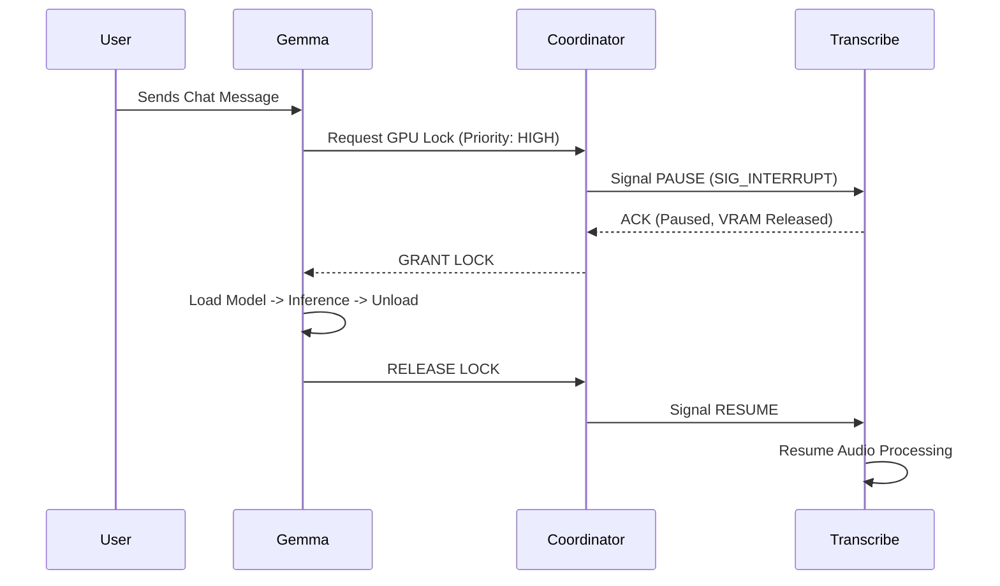

# GPU Coordinator: Distributed Resource Scheduler

> **"The Conductor of the Orchestra."**

The GPU Coordinator is a high-availability microservice designed to solve the **Single-GPU Contention Problem** in local AI architectures. It implements a custom **Preemptive Priority Semaphore** to orchestrate access to limited VRAM resources between latency-sensitive (Chat) and throughput-sensitive (ASR) workloads.

---

## 🛑 The Problem: VRAM Contention

In a typical local setup with one GPU (e.g., RTX 3090, 24GB VRAM):
1.  **LLM (Gemma 7B):** Requires ~16GB VRAM (Active).
2.  **ASR (Parakeet):** Requires ~4GB VRAM (Active).
3.  **Diarization:** Requires ~2GB VRAM.

Running all simultaneously results in `CUDA OutOfMemory` crashes. Standard container orchestrators (K8s) schedule based on *CPU/RAM*, not dynamic VRAM usage.

## ⚡ The Solution: Request-Based Locking

The Coordinator implements a **Mutex (Mutual Exclusion) State Machine** backed by Redis distributed locks.

### State Machine Protocol



---

## 🏗️ Architecture

### 1. Distributed Locking (Redis)
We use Redis atomic operations (`SETNX`) to ensure that only one service holds the "GPU Token" at any millisecond.
*   **TTL (Time-To-Live):** Every lock has a hard timeout (e.g., 30s) to prevent deadlocks if a service crashes while holding the lock.

### 2. Priority Queueing
Requests are processed based on user experience impact:
*   **Priority 0 (Critical):** User Chat (Latency Sensitive). Preempts everything.
*   **Priority 1 (High):** Voice Command Processing.
*   **Priority 2 (Background):** File Transcription / Indexing.

### 3. Graceful Preemption
The system does not simply "kill" the transcription process. It uses a Pub/Sub signaling channel (`channel:transcription:control`) to request a "Graceful Pause". The Transcription service finishes its current 2-second audio chunk, offloads its model to system RAM, and *then* acknowledges the pause.

---

## 🔌 API Specification

### Request Lock
```http
POST /gpu/request
```
**Payload:**
```json
{
  "service_id": "gemma-service",
  "priority": 0,
  "timeout_ms": 5000
}
```

### Release Lock
```http
POST /gpu/release
```

### Status Monitor
Returns real-time VRAM usage and current lock holder.
```http
GET /gpu/status
```

---

## 🛡️ Reliability Engineering

*   **Deadlock Detection:** A background "Watchdog" thread monitors lock durations. If a service holds a lock > TTL, it is forcibly revoked and the service is restarted.
*   **Queue Persistence:** Pending tasks are stored in PostgreSQL, ensuring that if the server reboots, the transcription queue is not lost.

---

**Pruitt Colon**
*Senior Architect*