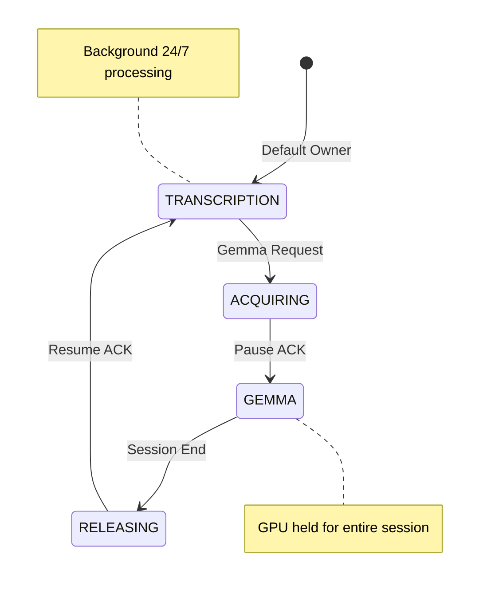
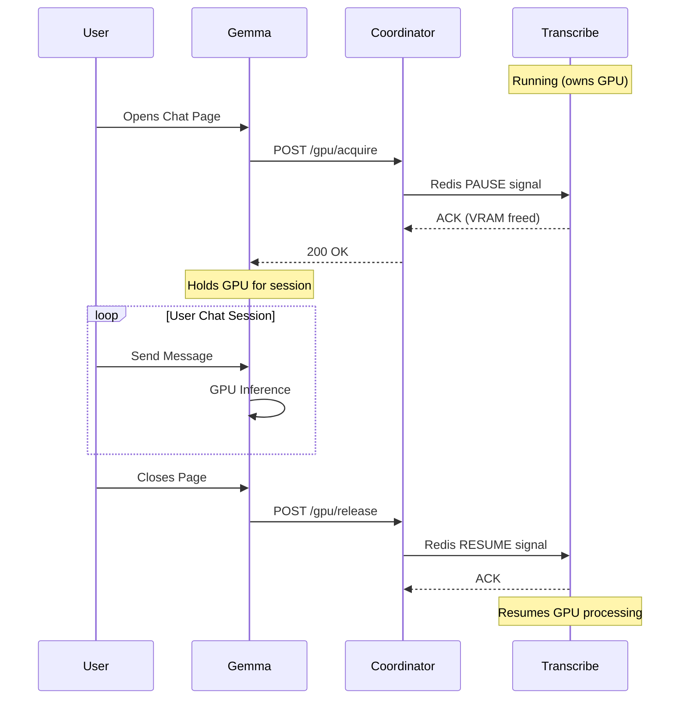

# GPU Coordinator: Distributed Resource Scheduler

> **"The Conductor of the Orchestra."**

The GPU Coordinator is a high-availability microservice designed to solve the **Single-GPU Contention Problem** in local AI architectures. It implements a custom **Preemptive Priority Semaphore** to orchestrate access to limited VRAM resources between latency-sensitive (Chat) and throughput-sensitive (ASR) workloads.

---

## Table of Contents

1. [The Problem](#the-problem-vram-contention)
2. [The Solution](#the-solution-session-based-locking)
3. [Architecture](#architecture)
4. [API Specification](#api-specification)
5. [Integration Guide](#integration-guide)
   - [Adding a New GPU Consumer](#adding-a-new-gpu-consumer-gemma-like-service)
   - [Adding a New GPU Owner](#adding-a-new-gpu-owner-transcription-like-service)
6. [Configuration](#configuration)
7. [Security](#security)
8. [Troubleshooting](#troubleshooting)

---

## The Problem: VRAM Contention

In a typical local setup with one GPU (e.g., GTX 1660 Ti, 6GB VRAM):

| Service | VRAM Required | Priority |
|---------|---------------|----------|
| Gemma 4B (Q4) | ~2.5GB | User-facing (chat) |
| Parakeet ASR | ~2GB | Background (transcription) |
| Diarization | ~1.5GB | Background |

Running all simultaneously results in `CUDA OutOfMemory` crashes. The GPU Coordinator ensures only one service uses the GPU at a time.

---

## The Solution: Session-Based Locking

The Coordinator implements a **Mutex State Machine** with session-based ownership:



### Session-Based Flow



---

## Architecture

### Distributed Locking (Redis)

- **Atomic Operations**: Uses Redis `SETNX` for lock acquisition
- **TTL (Time-To-Live)**: 30s hard timeout prevents deadlocks
- **Pub/Sub Channels**: Real-time signaling between services

### State Machine (`shared/gpu/state.py`)

```python
VALID_TRANSITIONS = {
    GPUOwner.TRANSCRIPTION: {GPUOwner.ACQUIRING},
    GPUOwner.ACQUIRING: {GPUOwner.GEMMA, GPUOwner.ML_SERVICE, GPUOwner.TRANSCRIPTION},
    GPUOwner.GEMMA: {GPUOwner.RELEASING},
    GPUOwner.ML_SERVICE: {GPUOwner.RELEASING},
    GPUOwner.RELEASING: {GPUOwner.TRANSCRIPTION},
}
```

### Priority Levels

| Priority | Use Case | Behavior |
|----------|----------|----------|
| `IMMEDIATE` (1) | User chat, predictions | Preempts background work |
| `BACKGROUND` (2) | Batch jobs, training | Waits for GPU availability |

---

## API Specification

### New Endpoints (v2)

#### Acquire GPU
```http
POST /gpu/acquire
Content-Type: application/json
X-Service-Token: <JWT>

{
  "session_id": "gemma-session-abc123",
  "requester": "gemma-service",
  "priority": "IMMEDIATE",
  "timeout_ms": 30000
}
```

**Response:**
```json
{
  "success": true,
  "session_id": "gemma-session-abc123",
  "acquired_at": "2024-12-26T22:00:00Z",
  "wait_time_ms": 1234.5
}
```

#### Release GPU
```http
POST /gpu/release
Content-Type: application/json
X-Service-Token: <JWT>

{
  "session_id": "gemma-session-abc123",
  "requester": "gemma-service",
  "result": {"tokens_generated": 150}
}
```

#### Query State
```http
GET /gpu/state
X-Service-Token: <JWT>
```

### Legacy Endpoints (Still Supported)

| Endpoint | Purpose |
|----------|---------|
| `POST /gemma/request` | Original Gemma acquire |
| `POST /gemma/release/{task_id}` | Original Gemma release |
| `GET /status` | Full coordinator status |
| `GET /health` | Health check |

---

## Integration Guide

### Adding a New GPU Consumer (Gemma-like Service)

A **GPU Consumer** is a service that requests GPU access on-demand (like Gemma or ML-Service).

#### Step 1: Add Shared Module Import

```python
# In your service's main.py
from shared.gpu.client import GPUCoordinatorClient, get_gpu_client
```

#### Step 2: Initialize Client on Startup

```python
from contextlib import asynccontextmanager

@asynccontextmanager
async def lifespan(app: FastAPI):
    # Startup
    gpu_client = get_gpu_client(service_auth=service_auth)
    healthy = await gpu_client.health_check()
    if healthy:
        logger.info("GPU Coordinator available")
    else:
        logger.warning("GPU Coordinator unavailable, will use CPU fallback")
    
    yield
    
    # Shutdown
    from shared.gpu.client import shutdown_gpu_client
    await shutdown_gpu_client()
```

#### Step 3: Acquire GPU Before Inference

**Option A: Context Manager (Recommended)**

```python
async def run_inference(prompt: str):
    gpu_client = get_gpu_client()
    session_id = f"my-service-{uuid.uuid4().hex[:8]}"
    
    async with gpu_client.gpu_session(session_id, "my-service") as acquired:
        if acquired:
            # GPU is available - move model to GPU
            model.to("cuda")
            result = model.generate(prompt)
            model.to("cpu")  # Release VRAM
        else:
            # Fallback to CPU
            result = model.generate(prompt)  # Slower but works
    
    # GPU automatically released on context exit
    return result
```

**Option B: Manual Acquire/Release**

```python
async def run_inference(prompt: str):
    gpu_client = get_gpu_client()
    session_id = f"my-service-{uuid.uuid4().hex[:8]}"
    
    result = await gpu_client.acquire_gpu(session_id, "my-service")
    
    try:
        if result.success:
            model.to("cuda")
            output = model.generate(prompt)
            model.to("cpu")
        else:
            output = model.generate(prompt)  # CPU fallback
    finally:
        await gpu_client.release_gpu(session_id, "my-service")
    
    return output
```

#### Step 4: Add Environment Variable

In `docker-compose.yml`:

```yaml
my-new-service:
  environment:
    GPU_COORDINATOR_URL: http://gpu-coordinator:8002
  depends_on:
    gpu-coordinator:
      condition: service_healthy
```

#### Step 5: Add Service Token Secret

```yaml
secrets:
  - jwt_secret_primary
  - jwt_secret_previous
  - jwt_secret
```

---

### Adding a New GPU Owner (Transcription-like Service)

A **GPU Owner** is a service that runs continuously on GPU and must pause when another service needs GPU (like Transcription).

#### Step 1: Add Shared Module Import

```python
# In your service's main.py
from shared.gpu.listener import GPUCommandListener, init_gpu_listener
```

#### Step 2: Create Pause/Resume Handlers

```python
async def on_pause(session_id: str, requester: str):
    """Called when coordinator signals to pause."""
    logger.info(f"Pausing for {requester} (session: {session_id})")
    
    # 1. Finish current work
    await finish_current_batch()
    
    # 2. Offload model from GPU to CPU
    model.to("cpu")
    torch.cuda.empty_cache()
    
    logger.info("Model offloaded, VRAM freed")

async def on_resume(session_id: str):
    """Called when coordinator signals to resume."""
    logger.info("Resuming GPU processing")
    
    # 1. Move model back to GPU
    model.to("cuda")
    
    # 2. Resume processing queue
    await resume_processing()
```

#### Step 3: Initialize Listener on Startup

```python
@asynccontextmanager
async def lifespan(app: FastAPI):
    # Startup
    listener = await init_gpu_listener(
        service_name="my-transcribe-service",
        pause_callback=on_pause,
        resume_callback=on_resume,
    )
    
    yield
    
    # Shutdown
    from shared.gpu.listener import shutdown_gpu_listener
    await shutdown_gpu_listener()
```

#### Step 4: Check Pause State Before Processing

```python
async def process_audio(audio_chunk):
    listener = get_gpu_listener()
    
    # Don't start new work if paused
    if listener.is_paused():
        queue.append(audio_chunk)
        return
    
    # Mark as processing (prevents pause during chunk)
    listener.set_processing(True)
    try:
        result = await model.transcribe(audio_chunk)
    finally:
        listener.set_processing(False)
    
    return result
```

#### Step 5: Add Redis Configuration

```yaml
my-transcribe-service:
  environment:
    REDIS_URL: redis://redis:6379
    REDIS_PASSWORD_FILE: /run/secrets/redis_password
  secrets:
    - redis_password
  depends_on:
    redis:
      condition: service_healthy
    gpu-coordinator:
      condition: service_healthy
```

---

## Configuration

| Variable | Default | Description |
|----------|---------|-------------|
| `REDIS_URL` | `redis://redis:6379` | Redis connection URL |
| `REDIS_PASSWORD_FILE` | `/run/secrets/redis_password` | Path to Redis password |
| `GPU_PAUSE_TIMEOUT` | `10.0` | Seconds to wait for pause ACK |
| `JWT_ONLY` | `true` | Require JWT authentication |

### Client Configuration

| Variable | Default | Description |
|----------|---------|-------------|
| `GPU_COORDINATOR_URL` | `http://gpu-coordinator:8002` | Coordinator URL |
| `GPU_REQUEST_TIMEOUT` | `30` | Request timeout in seconds |
| `GPU_FALLBACK_TO_CPU` | `true` | Fall back to CPU on failure |

---

## Security

- **Redis Authentication**: Password from Docker secrets
- **JWT Service Auth**: All endpoints require `X-Service-Token`
- **Replay Protection**: Request IDs tracked in Redis
- **Network Isolation**: Internal-only port binding

---

## Troubleshooting

### GPU Not Acquired

1. Check coordinator logs: `docker logs refactored_gpu_coordinator`
2. Verify Redis connection: `redis-cli -a <password> ping`
3. Check current GPU owner: `curl http://localhost:8002/gpu/state`

### Transcription Not Resuming

1. Check if pause ACK was sent: `docker logs refactored_transcription | grep PAUSE`
2. Verify Redis pub/sub: messages should appear on `transcription_resume` channel
3. Force reset: `curl -X POST http://localhost:8002/admin/force-reset`

### OOM Errors

1. Check if release was called: Look for `/gpu/release` or `/gemma/release` in logs
2. Verify VRAM freed signal: `docker logs refactored_gpu_coordinator | grep vram_freed`
3. Monitor GPU: `watch -n 1 nvidia-smi`

---

## File Structure

```
shared/gpu/
    __init__.py      # Public API exports
    state.py         # GPUOwner enum, GPUState dataclass
    protocol.py      # Pydantic models for HTTP/Redis
    client.py        # GPUCoordinatorClient (for consumers)
    listener.py      # GPUCommandListener (for owners)

services/queue-service/
    src/
        main.py              # FastAPI app with endpoints
        gpu_lock_manager.py  # Core locking logic
        gpu_monitor.py       # nvidia-smi wrapper
        task_persistence.py  # PostgreSQL queue
```

---

**Pruitt Colon**
*Senior Architect*